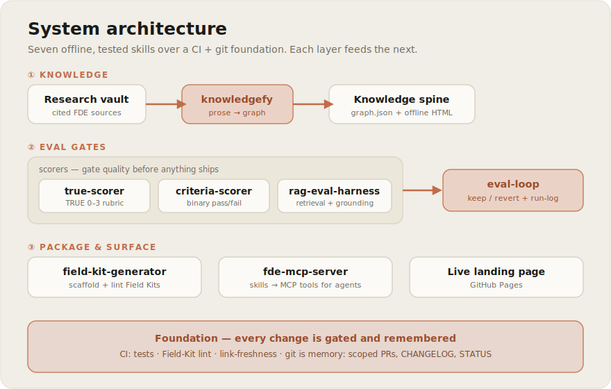

# Architecture

How FDE-os is put together. For *what it is and why*, see [`README.md`](README.md); for the
ordered build decisions, the [roadmap plan](docs/plans/2026-06-20-001-feat-fde-os-staged-roadmap-plan.md)
(immutable); for *where we are now*, [`STATUS.md`](STATUS.md).



## Principles (they explain every choice below)

- **Offline & deterministic by default.** Every native skill runs with no network and produces
  byte-reproducible output. Network/LLM judgment is always an explicit, opt-in hook — never the core.
  This is what lets the tools run inside a customer perimeter and in CI.
- **Eval-gated.** Nothing ships unscored. Three scorers gate quality; a loop keeps only improvements.
- **Git is the memory.** Progress, decisions, and keep/revert history live in scoped PRs +
  `CHANGELOG.md`, not in mutable status fields. The roadmap plan is a *decision artifact* and is
  never edited to record progress.
- **stdlib-only, tested.** No third-party runtime deps; each skill ships a `unittest` suite that CI
  auto-discovers.

## The layers

### ① Knowledge — turn sources into a navigable spine
- **`knowledgefy`** parses a local *prose* research vault (Markdown headings → concept nodes, inline
  + bare-URL citations → evidence nodes) into a `graph.json` + a self-contained offline HTML spine.
  It fills the gap `living-repo` (GFM-tables-only) and `kgfy` (needs a running engine) leave.
- Output: `knowledge/fde-spine.*` — the canonical spine every post, kit, and lesson draws from.

### ② Eval gates — score before you trust
Three interchangeable scorers, each exposing the same `gate(...)` shape:
- **`true-scorer`** — the TRUE rubric (T/R/U/E, 0–3 each); gate at total ≥ 10 with no letter < 2. The
  publish gate for Delta posts.
- **`criteria-scorer`** — binary pass/fail criteria as typed, mechanically-checkable predicates
  (word count, required/forbidden regex, has-a-number, has-a-citation) → 0–1. The general artifact eval.
- **`rag-eval-harness`** — retrieval metrics (precision@k, recall@k, MRR, hit-rate) + a
  grounding/hallucination proxy + citation coverage. For RAG/agent systems.

Then **`eval-loop`** wraps any scorer into the self-improving primitive: score artifact versions,
keep a version only if it strictly beats the best so far, revert regressions, and append a run-log
(Round │ Change │ Score │ Verdict). It is *assisted, not autonomous* — humans own taste, the gates
own the floor, git owns the memory.

### ③ Package & surface — make capability forkable and callable
- **`field-kit-generator`** scaffolds + lints a Delta Field Kit to convention (the Field Kit menu,
  names-its-source, marks-unknowns-as-RISKS); skill synthesis itself is delegated to `skillfy`.
- **`fde-mcp-server`** is a stdlib MCP server (stdio JSON-RPC) exposing the skills as MCP tools
  (`true_score`, `rag_eval`) — a runnable "1+ Claude MCP integrations" reference.
- **Live landing page** (`index.html`) — the Delta community door, served via GitHub Pages.

### Foundation — gated and remembered
- **CI** (`.github/workflows/`): `tests.yml` auto-discovers every `skills/*/tests` suite + runs the
  Field-Kit lint on each push/PR; `freshness.yml` keeps external links honest (fails only on dead
  links; bot-walls are warnings).
- **Git as memory**: scoped per-stage PRs, `CHANGELOG.md` (incl. *Investigated / Rejected*),
  `STATUS.md` (the glance). The roadmap plan stays immutable.

## How a Delta post flows through the system (the spine in motion)

```
research vault ─[knowledgefy]→ knowledge spine ─[draft]→ Field Manual
   └─[true-scorer gate ≥10]→ publish    └─[field-kit-generator + skillfy]→ Field Kit
        └→ war-story prompt → community → field stories ─(feed back)→ vault
```

Each post advances three objectives at once: the article (ignition), its Field Kit (Objective 2
tooling), and its war-story prompt (Objective 3 community) — content production *is* product
production.

## Repository map

| Path | Role |
|---|---|
| `skills/` | The 10 native skills (each: `SKILL.md` + `scripts/` + `tests/`). |
| `knowledge/` | Generated spine (regenerate with `knowledgefy`; don't hand-edit). |
| `field-kits/` | Forkable Field Kits, one per post. |
| `course/` | Objective-1 course: `target-jds/` (validation targets) + `prep/` (dual-tier curricula + lessons + tools). |
| `flywheel/` | Objective-3 infra + production runbook/metrics (mostly gated). |
| `docs/plans/`, `docs/ideation/`, `docs/research/`, `docs/assets/` | Roadmap, ideation, external-source evals, infographics. |
| `scripts/` | Repo tooling (`check_freshness.py`). |
| `index.html`, `.github/workflows/` | The live site + CI. |

## What's deliberately *not* here

No third-party runtime dependencies; no autonomous "runs while you sleep" loop (the loop is
assisted); no custom community forum (rented spokes + an owned list until flow exists); the heavy
course/flywheel/compiler stages are **gated** on content traction, each needing its own plan.
