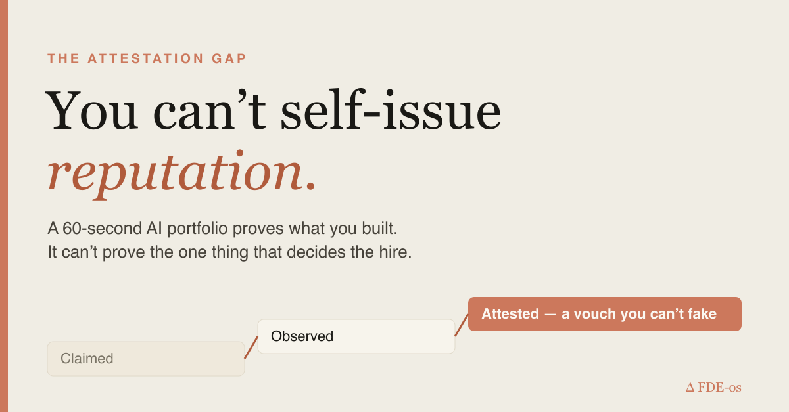
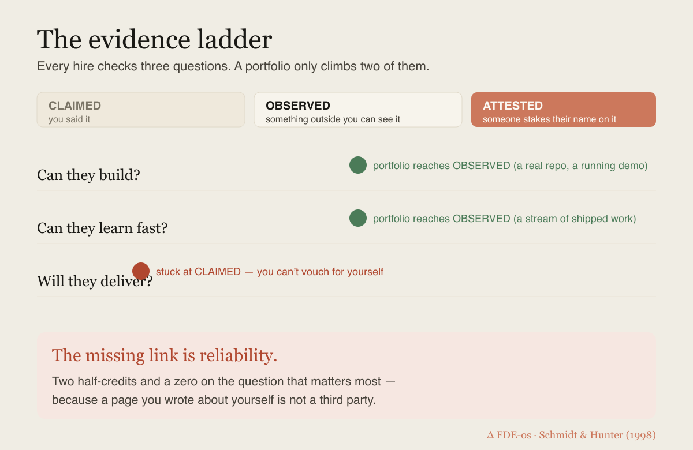
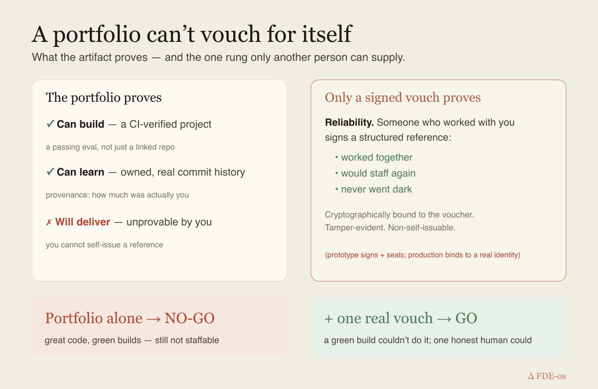

# You can build an AI portfolio in 60 seconds. That's exactly why it won't get you hired.

*Long-form. ~7 min. Simple enough for a sharp 15-year-old, honest enough for a hiring lead who's seen a thousand résumés.*



---

## Start with the thing everyone's cheering for

Résumés are dying. Good riddance. The new advice is everywhere: *don't tell them, show them* — ship an AI-agent portfolio that answers questions about your work 24/7, grounded in your real repos. You can stand one up in about **60 seconds**.

I think that shift is right. Bottom-up — prove it by building — beats top-down — trust my credentials — every time.

And I think the 60-second portfolio, as most people will use it, still won't get them hired.

Not because it's fake. Because of **what a self-made artifact can and cannot prove** — and the one thing it structurally can't is the one thing that decides the hire.

## The three questions behind every hire

Strip away the theater and a hiring lead is checking exactly three things:

1. **Can they build?** (technical competence)
2. **Can they learn fast?** (resourcefulness)
3. **Will they show up and deliver?** (reliability)

This isn't opinion. Eighty-five years of selection research (Schmidt & Hunter) says the top predictors of on-the-job performance are **work samples** and **structured references** — evidence, not claims. A portfolio is a bet on that truth.

So how far does the portfolio actually get you? Put each question on a ladder of evidence:



- **Claimed** — you said it. (A résumé bullet.)
- **Observed** — something outside you can see it. (A repo, a running demo.)
- **Attested** — someone who has no incentive to lie stakes *their* name on it.

A portfolio moves **"can they build"** and **"can they learn"** from *claimed* up to *observed*. That's real progress. But it leaves **"will they deliver"** stuck at *claimed* — because **you cannot self-issue reputation.** A page you wrote about yourself is, by definition, not a third party.

That's the missing link. And it gets worse at scale.

## When everyone has one, the portfolio stops being a signal

A signal only works if not everyone can send it. The moment a polished, AI-narrated portfolio takes 60 seconds, *everyone* has one — and an eloquent agent describing your projects becomes background noise. Bottom-up only beats top-down when the action is **costly, attributable, and verifiable.** A cheap, self-authored narration is none of those. It quietly slides back into being a prettier résumé — top-down in bottom-up clothing.

Even the "observed" tier leaks:

- **A linked repo isn't proof you wrote it.** Attribution is the oldest question in hiring — *how much of this was actually you?* A logo wall of repos doesn't answer it.
- **A repo existing isn't proof it works.** "I built an agent" and "here is an agent that passes its own evals on every commit" are different universes.

So the honest scorecard for the 60-second portfolio: **two half-credits and a zero on the question that matters most.**

## The part nobody's building — and it's enforceable

Here's the fun part: every gap above can be closed with technology, and none of it requires trusting anyone's word.

**Provenance.** Don't link a repo — bind it. Verified commit authorship, contribution percentage, a build-in-public timeline. *Observed* becomes *attributable.*

**A verified badge.** A project counts as "works" only when a reproducible eval actually passes in CI — a green light earned by a run, not a checkbox someone ticked.

**A vouch you can't fake.** This is the one that closes reliability. A person who worked with you signs a structured reference — bound to *their* identity, cryptographically sealed so no field can be edited, and **impossible to issue for yourself.** Reliability lives only at the *attested* tier, and this is how you get there.

I coined a name for the whole failure mode while building this: **the attestation gap** — the space between what you can say about yourself and what someone else will stake their name on. Portfolios are racing to fill the "observed" tier. The gap is one rung higher.

## The moment it clicked

I wired this into a working gate and fed it a strong portfolio: two projects, clean code, **green builds on every commit.** Technically excellent.

The gate said **NO-GO.**

It wasn't missing code. It was missing a *person.* Zero vouches — nobody who'd worked with this person had put their name down. So on reliability, the most decision-relevant axis, the evidence was still just… a claim.

Then one former teammate signed a thirty-second structured vouch — *worked together, would staff again, never went dark* — and the same portfolio flipped to **GO.**

A green build couldn't do it. One honest human could. That's the whole thesis in one screen.



## What this means if you're building your portfolio

- **Keep shipping.** The "observed" tier is real and most people don't even have that. Do it.
- **Make your work attributable and verified**, not just linked — provenance and a passing eval beat a logo wall.
- **Go collect the rung you can't self-issue:** ask two people who've worked with you for a structured vouch. That single artifact outweighs the entire rest of the page, because it's the only part you couldn't have written yourself.

And the honest caveat, because honesty is the brand: a signature proves *server-issued, tamper-evident, and not-self-issued.* It does **not** yet prove the voucher is a distinct real human — that needs identity binding (sign in with GitHub before you can vouch). That's the next rung, and I'm building it in the open.

## Try this in 60 seconds (it's all open)

Don't take my word for it — run the exercise:

1. **See which rung you're missing.** Paste your own portfolio link into the open checker → it reads your public evidence and tells you plainly what's proven and what isn't: **`portfolio-trust.vercel.app`**
2. **Close the gap.** It's almost always the same rung — reliability. Ask one person who worked with you to sign a 30-second structured vouch on the same site ("Vouch for someone"). Watch a NO-GO flip to GO.
3. **Fork it.** The whole trust layer — signed non-self-issuable vouches, provenance, and the eval-gate — is open source. Wire it into your own portfolio:

```bash
# the agent-card evidence a portfolio should publish, and the gate that reads it
git clone https://github.com/wjlgatech/FDE-os
# → portfolio-trust/  (vouch + verify + ingest, deployed on Vercel)
```

A portfolio that carries verified provenance, a passing eval, and one real vouch is a different object than a page of claims. Build that.

## The one line to remember

The résumé died because anyone could write anything. If we replace it with a portfolio anyone can generate in 60 seconds, we've just rebuilt the résumé with better fonts.

The fix isn't more self-presentation. It's the one piece of evidence you were never able to issue yourself.

**Save this if you're about to build (or hire from) an AI portfolio.** What's the strongest signal you've ever seen that someone would actually deliver — and could a portfolio have carried it?
