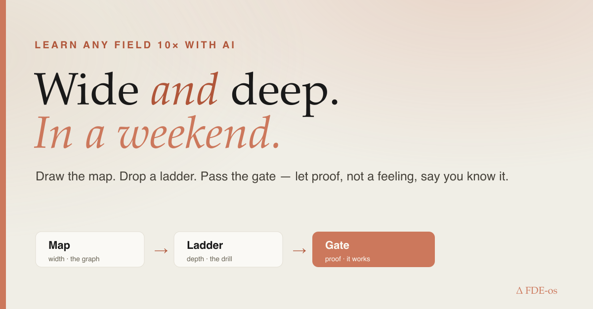
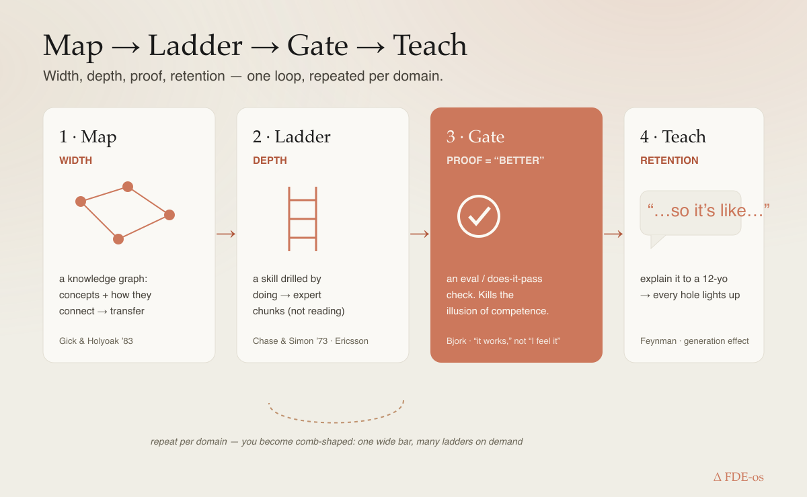
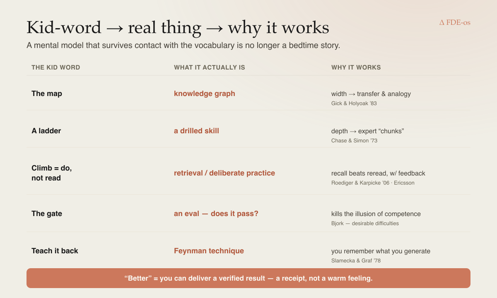

# How to learn any field 10× faster with AI — wide *and* deep — without fooling yourself

*Long-form. ~7 min. A mental model a 12-year-old can run, mapped term-by-term to the real cognitive
science, with jokes engineered to make it unforgettable.*

---

## The weekend that shouldn't have been possible

Last week I had about **48 hours** to get ready for a role built on a stack I had never touched —
an MLOps platform plus an access-control layer, the kind of thing people list "5+ years" for.

Old me would have panic-read documentation until my eyes bled and I *felt* smart. New me did
something different, and by Sunday night I had a **map of the whole territory (32 concepts, linked)**
*and* a **working proof that actually ran and passed its own test.** Wide and deep. In a weekend.

I'm not special. I just stopped learning the way we were taught, because AI quietly broke the old
rules — and almost nobody has updated their mental model. Here's the one I use. A 12-year-old can
run it. It also happens to be exactly what the learning-science literature has been screaming for 40
years.

## First, kill the word "better." Define it or it's useless.

You asked the right question: *10× better in what sense?*

Not "knows more facts." Knowing is cheap now; a chatbot knows more facts than any human who ever
lived and still can't ride a bike. **Better = you can deliver a verified result.** You can *do* the
thing, and something outside your own head confirms it works. Comprehension is a feeling.
Competence is a receipt.

Hold that, because it's the whole game: the fastest way to fool yourself with AI is to mistake a
warm feeling of understanding for the ability to produce a result. More on that con artist shortly.

## The mental model: **Map, Ladder, Gate**

Picture learning a new field as exploring a mountain range.

- **The Map** is *width.* The whole territory from above — every peak, and the trails connecting
  them. You can't climb a map, but without one you don't even know which mountain matters.
- **A Ladder** is *depth.* You pick one spot and go straight down (or up) until you can actually
  operate there — not admire it, *operate* it.
- **The Gate** is *proof.* At the bottom of the ladder there's a turnstile that only opens if the
  thing you built actually works. No receipt, no pass.

Old-school learning forced a cruel trade: spend years on one ladder (deep but narrow — the person
who knows everything about one bolt and nothing about the bridge), *or* wander the map forever
(wide but shallow — the person at the party who has a hot take on everything and can build none of
it).

AI ends the trade. It draws the entire map in an afternoon **and** builds you a ladder on demand,
anywhere you point. T-shaped is so 2015. AI makes you **comb-shaped**: one wide bar across the top,
and a whole row of ladders you drop wherever the ground gets interesting. (Yes, your career is now
a hair-care product. I don't make the metaphors, I just ship them.)

## The same model, mapped term-by-term to the real thing

Because a mental model that can't survive contact with technical vocabulary is just a bedtime story:

| Kid word | What it actually is | Why it works (the science) |
|---|---|---|
| **The map** | a **knowledge graph** — concepts as nodes, relationships as edges | Width fuels *transfer*: you solve a new problem by analogy to a far one. Gick & Holyoak (1983) showed people crack a problem the moment they're handed a structurally-similar story from another domain. The map *is* your stock of analogies. |
| **A ladder** | a **skill drilled to a passing bar** | Depth is *chunking*: experts don't have better memory, they see bigger patterns. Chase & Simon (1973) — chess masters recall real boards effortlessly and random boards no better than novices. Ladders build chunks. |
| **Climbing = doing, not reading** | **retrieval practice / deliberate practice** | Recall beats reread, hard: Roediger & Karpicke (2006) — testing yourself crushes re-studying for long-term retention. And Ericsson's deliberate practice is climbing *with feedback*, not just climbing. |
| **The Gate** | an **eval / a does-it-actually-pass check** | This is where "better = it works" lives, and it's the antidote to the illusion of competence (Bjork's *desirable difficulties*): fluency feels like mastery and isn't. The gate refuses to care how you feel. |
| **Teaching the map back** | the **Feynman technique / the generation effect** | Explaining it out loud exposes every hole you papered over (Slamecka & Graf, 1978 — you remember what you *generate* far better than what you read). |

## The con artist in the lab coat (the one trap that ruins everything)

Here is the failure mode, and it is *devastating* with AI specifically.

You ask AI to explain a hard thing. It writes a gorgeous, fluent, confident explanation. You read
it, nod, feel the warm click of *"ah, I get it."* You move on.

You got nothing. You rented a feeling.

That warm click is the **illusion of competence** — a tiny con artist who lives in your head, wears
a lab coat, and whispers "you totally understand this" right up until someone asks you to *build*
it, at which point he grabs his coat and leaves through the window. AI is rocket fuel for this con,
because it makes the *explanations* frictionless while the *doing* stays exactly as hard as it ever
was.

Reading a manual about swimming is not swimming. AI can hand you the greatest swimming manual ever
written in three seconds. You will still drown — now with excellent theoretical posture.

The Gate is how you evict the con artist. He cannot survive a passing test.

## So what does AI actually 10× — and what stays stubbornly human?

Be precise, because the hype is lazy here. AI is a **genie that draws the treasure map and
3D-prints the shovel.** It does not dig. And if you skip the digging, it will cheerfully walk you
off a cliff while you nod along.

**What AI collapses from months to hours:**
- **Drawing the map** — fan out across a field, synthesize the territory into a graph of what
  connects to what. (Weeks of reading → an afternoon.)
- **Building the ladder's rungs** — worked examples, a drill, a term-by-term translation from
  kid-words to jargon, a tireless critic that quizzes you at 2am.
- **Standing up the Gate** — a check that says pass/fail on what you built, instantly.

**What is still, gloriously, on you:**
- **Climbing.** The reps. The retrieval. AI can build the pool, the coach, and the stopwatch in
  ten minutes. You still have to get in the water.
- **Choosing which ladder.** The map shows ten peaks; taste picks the one that's load-bearing.
- **Passing the Gate honestly** — not deleting the failing test because it hurt your feelings.

The 10× isn't "read faster." It's "**build the pool, the coach, and the stopwatch instantly, then
actually swim.**" Same swimming. Radically less setup, and a stopwatch that never lies to you.

## The loop, in four moves you can run this afternoon

1. **Map it (width).** Have AI fan out the field and hand you a graph: the concepts and how they
   connect. Now you can see the whole board instead of memorizing one corner of it.
2. **Drop a ladder (depth).** Pick the load-bearing node. Get worked examples + a drill + the
   term-by-term mapping. Climb by *doing*, not reading — recall, attempt, get corrected, repeat.
3. **Pass the Gate (better).** Build the smallest real artifact and check it against something
   outside your head. It runs? It passes? *That's* the receipt. Feelings don't count.
4. **Teach it back.** Explain the map to a 12-year-old (or a rubber duck, or LinkedIn). The holes
   light up instantly. Patch them. Now it's yours.

Map → Ladder → Gate → Teach. Width, depth, proof, retention. Repeat per domain.

## My weekend, decoded

That unfamiliar stack? I had AI **draw the map** — a 32-node knowledge graph of the whole domain,
built in an afternoon, links and all. I **dropped ladders** on the three load-bearing concepts. I
**passed the Gate** by building the smallest working slice with a test that actually goes green.
Then I **taught it back** in a one-page write-up (the one that made the holes obvious — there were
three; now there are zero).

Both are open, so you can check the receipt instead of trusting the story:
- **the map** — the 32-concept graph → [`wjlgatech.github.io/FDE-os/knowledge/mlops-rbac-migration-spine.html`](https://wjlgatech.github.io/FDE-os/knowledge/mlops-rbac-migration-spine.html)
- **the proof** — a custom RBAC authorization layer (a Policy Decision Point + an enforcement middleware) with a **(subject, action, resource) → allow/deny test table that passes** → [`github.com/wjlgatech/FDE-os/tree/main/course/prep/tools/rbac-mlrun-demo`](https://github.com/wjlgatech/FDE-os/tree/main/course/prep/tools/rbac-mlrun-demo) · [try it live](https://wjlgatech.github.io/FDE-os/rbac-demo.html)

Wide, deep, and *proven* — in the time it used to take to feel vaguely prepared and be secretly
terrified.

## Try it (one afternoon, one field you're scared of)
Pick a domain. Run the loop: ask AI to graph the territory → drill the one load-bearing node by
doing → build a tiny artifact and gate it → teach it back. Ship the artifact publicly. The tooling
I use to make each step real (knowledge-graph builder, drill-as-gate, a readiness self-check) is
open: **`github.com/wjlgatech/FDE-os`**.

## The one line to remember
Old rule: you could be **wide or deep**, pick one, and it took years.
New rule: AI hands you **wide *and* deep in a weekend — but only if you let a Gate, not a feeling,
decide when you actually know it.**

**Save this** if you're about to learn something hard and scary. What's the field you'd map this
weekend if drawing the map took an afternoon instead of a year?
