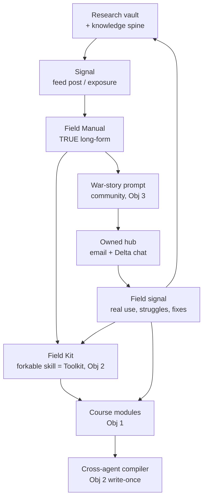
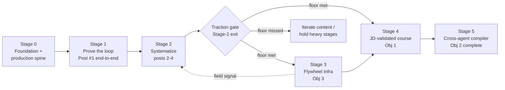

# feat: FDE-os Staged Roadmap

A six-stage build plan for FDE-os, sequenced along the **Delta content spine**: each Delta
post ships a Field Kit (building the toolkit) and a war-story prompt (building the community),
and the traction those create funds the heavier flywheel infrastructure and the JD-validated
course. Content production *is* product production — so the series is the engine, not a fourth
objective bolted on.

Stages 0–2 carry deep, build-ready specs. Stages 3–5 are deliberately lighter — they will be
sharpened by what the early stages reveal, per the TRUE spec's "prove one, then systematize"
discipline.

---

## Summary

FDE-os has three objectives (a JD-validated course, cross-agent FDE tooling, and a
field-practice feedback flywheel) plus **Delta**, the public content layer that ignites all
three. Today the repo holds a proven Post #1 (Field Manual scored 12/12 + a working Field Kit),
the TRUE article spec, a community strategy, a viral playbook, and a 7-thread cited research
vault. Nothing is wired into a repeatable production loop yet, and none of the three objectives
has infrastructure.

This plan stages the work so the cheapest, already-moving asset (Delta) becomes the flywheel's
prime mover. Each post is run through a proven 1-input→4-output pipeline (vault → Signal →
Field Manual → Field Kit → war-story prompt). The pipeline is built once on existing agent
skills — `dreammaketrue` to draft, `skillfy`/`skill-distillery` to mint Field Kits,
`living-knowledge` to draft course lessons — plus a small set of FDE-os-native skills designed
only where a genuine gap exists: a local-first **`knowledgefy`** (research vault → offline
navigable knowledge spine), a runnable **`TRUE-scorer`** (the publish gate), and a
**`field-kit-generator`** (the Field Kit convention wrapped around `skillfy`).

The result is a flywheel that compounds: articles win attention → the toolkit gives leverage →
the community retains people and produces field stories → which become the next articles, and
feed the course's real scenarios and eval cases.

---

## Problem Frame

A requirements doc is a lossy compression of a reality the customer can't fully articulate —
that is the thesis of Post #1, and it is also the problem this plan solves for FDE-os itself.
The project's value is spread across eight strong-but-disconnected documents and twelve ranked
ideation directions (I1–I12). Without a spine that orders them, the predictable failure mode is
either (a) trying to build all three objectives at once and finishing none, or (b) templating
all twelve posts in the abstract and proving none.

The constraint that resolves both: **one closed loop, proven once, then mass-produced.** The
Delta series is the only asset already in motion and the only one whose production directly
accretes a second objective (every Field Kit is cross-agent tooling) and seeds a third (every
war-story prompt feeds the flywheel). So the content engine leads; the course and the flywheel
infra are downstream stages it funds.

The named user directive — *apply existing skills (`living-knowledge`, `skillfy`) and design
new ones (`knowledgefy` and the like)* — is honored as a first-class design constraint: the
plan reuses the existing knowledge/skill tooling as the engine and designs FDE-os-native skills
only where the existing tools leave a real gap.

---

## High-Level Technical Design

### The flywheel (what every stage feeds)



The wire that matters: **field signal flows back into the vault, the course, and the toolkit.**
The `Field --> Kit` edge is the toolkit-fix half of R5 (pain-to-ticket, U15, produces Field Kit
fixes) — it is load-bearing, not decorative.
Break that wire and FDE-os is a blog plus a course plus some scripts. Keep it closed and it is
a machine that converts field reality into product — the same shape Post #1 describes.

### Stage dependency graph



Stages 3 and 4 are **gated**, not automatic: a quantified traction floor measured at Stage-2
exit (see "Stage Gates & Kill Signals" below) decides whether the heavy downstream stages are
funded. The course (Stage 4) is materially better once the flywheel (Stage 3) is feeding it real
scenarios, hence the S3→S4 edge. The dotted edge marks the loop closing back onto content.

### Stage Gates & Kill Signals

The plan's load-bearing bet is that Delta traction funds Stages 3–5. That bet must be
*falsifiable*, or the roadmap marches into multi-month infrastructure regardless of whether the
content landed. Three explicit gates make it so:

- **Gate A — Stage 1 → Stage 2 (proof, not just mechanics).** Entering Stage 2 (investing in
  automation) requires not only that the pipeline *ran* but that Post #1 cleared a minimum funnel
  outcome on the U7 instrumentation — a non-zero owned-list conversion and at least a handful of
  Field Kit forks. Proving the machinery works is not the same as proving the content earns
  attention; this gate separates the two.
- **Gate B — Stage 2 → Stages 3/4 (the funding floor).** Before committing to the heavy flywheel
  infra or the course, the content engine must clear a quantified traction floor across posts 1–4
  (the exact metric and threshold are an Open Question — candidate: a per-post owned-list
  conversion rate and Field-Kit-fork count sustained over the four posts). **If the floor is
  missed, the default branch is to iterate content, not to proceed** — the heavy stages hold.
- **Stages 4 and 5 are separate follow-on initiatives, not the tail of this plan.** The JD-validated
  course (Stage 4) and the cross-agent compiler (Stage 5) are each substantial standalone systems
  (a fight-back customer simulator, a write-once cross-runtime compiler). They are scoped here at
  roadmap altitude so the arc is legible, but **approving this plan does not authorize building
  them** — each requires its own `ce-plan` pass and a fresh scoping gate after Stage 3. Their
  "lighter spec" status reflects exactly this: they are direction, not build-ready specification.

This makes the staged sequencing do its job — cheap proof before expensive commitment — instead
of being sequencing in name only.

---

## Requirements

Traced to the three objectives (O1 course, O2 toolkit, O3 flywheel) and Delta (D).

- R1. (D, O2) Every Delta Field Manual ships exactly one forkable Field Kit, drawn from the
  Field Kit menu; kits accumulate into the cross-agent tooling layer.
- R2. (D) No post publishes until it scores ≥ 10/12 on the TRUE rubric with no single letter
  below 2. The rubric is itself a runnable asset.
- R3. (O3) Every public surface routes to the owned hub (email list). If a surface doesn't
  capture, it doesn't count — this is a hard guardrail, not a preference.
- R4. (D) The research vault is the single sourced input; an agent produces ~90% of each post
  from it, the human adds the 10% taste + lived experience. No post invents un-sourced facts.
- R5. (O3) The flywheel must close: field signal (war stories, tool-failure reports) feeds back
  into content, course scenarios, and toolkit fixes — with attribution preserved.
- R6. (O1) Course content is JD-validated: given a target job description, the curriculum
  demonstrably trains a learner toward it, measured on a single mastery scale.
- R7. (O2) Field Kits and course skills run across at least two agent runtimes (Claude + one of
  Codex / Hermes / OpenClaw), authored once.
- R8. (O3) Field capture is privacy-redacted **at capture time**, anchored to the diff — raw
  sensitive data never persists. Born-clean, not cleaned-after.
- R9. (cross-cutting) Existing skills are reused as the production engine; a net-new skill is
  designed only where the existing tools leave a demonstrated gap.

---

## Key Technical Decisions

- KTD1. **Delta-content-first spine.** Content production is product production: each post
  accretes O2 (a Field Kit) and seeds O3 (a war-story prompt), so the series is the cheapest
  way to advance three objectives at once. The course and flywheel infra are downstream stages
  the content funds. (User-confirmed; see origin: README.md "Delta — the content flywheel".)
- KTD2. **Own the list, rent everything else, build nothing custom yet.** The email list is the
  only owned asset; LinkedIn/HN/Discord/Reddit are rented spokes. No custom forum or website
  until flow exists. (see origin: Delta-community-strategy.md.)
- KTD3. **Spike before building a local-first `knowledgefy` skill.** The candidate gap is
  *offline + deterministic extraction over heterogeneous prose* — not "ingest a local vault,"
  which `dreammaketrue`/`kgfy` already does (it accepts a local file or folder), and not
  "deterministic stdlib parse," which `living-repo`'s `awesome_kg.py` already does (but only over
  GFM tables, not prose). So the honest gap is narrow: a deterministic, no-network parse of a
  *prose* vault into a spine, without `dreammaketrue`'s engine or live web. **Because the gap is
  narrow, U2 starts with a spike** — run `kgfy` and `living-repo` on the real
  `FDE-research-synthesis.md` first. If either output is acceptable (or `living-repo`'s parser
  extends to prose headings cheaply), `knowledgefy` collapses to a thin extension or is dropped;
  only if both genuinely fall short does the net-new skill get built. This avoids speculative
  Stage-0 tooling.
- KTD4. **`TRUE-scorer` as a runnable skill, not a checklist.** The 0–3 rubric is already
  specified as agent-runnable; making it a gate skill means no post can publish un-scored.
- KTD5. **Build the Field-Kit generator on `skillfy`/`skill-distillery`, not from scratch.**
  `skillfy` already compresses expertise into a verifiable skill artifact with honest edges and
  discernment checks. The native `field-kit-generator` is a thin wrapper enforcing the Field Kit
  menu + folder convention; it does not re-implement skill synthesis.
- KTD6. **Redact-at-capture, anchored to the diff (I9).** Capture the structural shape of the
  work (the diff, the decision) with secrets/PII masked before anything is written, rather than
  storing raw data and scrubbing later. Born-clean is the only posture that survives a real
  customer-perimeter constraint (R8).
- KTD7. **One mastery scale, chosen at the start of the course stage (I2).** Collapsing
  CEFR ↔ FDE ladder ↔ JD level into a single number makes every downstream course feature
  (JD-compile, lesson read, eval-gate) a comparison on one axis instead of N pairwise mappings.
- KTD8. **Prove-one-then-systematize.** Deep specs for Stages 0–2; lighter specs for 3–5. The
  TRUE spec explicitly warns against templating all twelve posts in the abstract; the same
  applies to the course and flywheel infra. (User-confirmed spec-depth choice.)

---

## Skills Integration Map

How the named directive ("apply existing skills, design new ones") resolves per skill. Reuse is
the default; "design" is reserved for the three verified gaps.

| Skill | Reuse / Design | Applied in | Role in FDE-os |
|---|---|---|---|
| `knowledgefy` (native) | **Design** | Stage 0 (U2–U3) | Local research vault → offline navigable FDE knowledge spine; deterministic, no web/paid engine |
| `TRUE-scorer` (native) | **Design** | Stage 0 (U4) | Score a draft 0–3 per TRUE letter; hard publish gate (R2) |
| `field-kit-generator` (native) | **Design** | Stage 2 (U8) | Thin wrapper over `skillfy`: enforces Field Kit menu + folder convention, names source article |
| `knowledge-graph` | Reuse (optional, not yet wired) | — | Engagement-weighted topic graph where *live web* sources are needed (e.g. the labs' latest postings). No current unit invokes it — external web research is deferred (see Sources & Research); available as opt-in enrichment for a future web-sourced post |
| `dreammaketrue` | Reuse | Stage 2 (U9) | Research spine → Signal/Field Manual drafts; grounded avatars (Karp, Qureshi, Mabrey) for voice checks; `express` to LinkedIn artifact |
| `skillfy` / `skill-distillery` | Reuse | Stage 2 (U8) | Underlying engine the Field-Kit generator calls to mint each kit |
| `living-knowledge` | Reuse | Stage 4 (U20) | Draft concept-first, 15-yo-legible course lessons (matches TRUE's "U") |
| `living-repo` | Reuse | Stage 0 (U1) | Freshness checks on the field-kits index + references tables (it already parses GFM tables) |

---

## Output Structure

The repo grows three new top-level homes (`skills/`, `course/`, `flywheel/`) alongside the
existing content artifacts and `field-kits/`. The per-unit `**Files:**` sections are
authoritative; this tree is the scope declaration.

```text
FDE-os/
  Delta-*.md                       # content artifacts (exist)
  FDE-research-synthesis.md         # the vault (exists)
  field-kits/                       # forkable kits (exists; grows one per post)
    delta-discovery-protocol/       # Field Kit #1 (exists)
  skills/                           # FDE-os-native skills (new)
    knowledgefy/
      SKILL.md
      scripts/knowledgefy.py
    true-scorer/
      SKILL.md
      scripts/score.py
    field-kit-generator/
      SKILL.md
      scripts/generate.py
  knowledge/                        # generated spine (new, from knowledgefy if built)
    fde-spine.graph.json
    fde-spine.html
  flywheel/                         # Objective 3 infra (new, Stage 3)
    capture/                        # redact-at-capture (I9)
    journal/                        # field-journal hub (I8)
    portfolio/                      # engineer-owned portfolio (I11)
    pain-to-ticket/                 # back half (I10)
  course/                           # Objective 1 (new, Stage 4)
    mastery-scale.md                # the single scale (I2)
    jd-compiler/                    # JD in → curriculum spec (I1)
    lessons/                        # self-authored, gated lessons
  docs/
    plans/                          # this plan
    ideation/                       # ideation doc (exists)
  .github/workflows/                # CI invariants + freshness (new)
```

---

## Stage 0 — Foundation & Production Spine

*Deep spec. Goal: make the 1-input→4-output pipeline mechanically possible before any
mass production. Nothing here is customer-facing.*

### U1. Repo spine, conventions, and CI invariants

- **Goal:** Establish the curriculum-as-repo substrate so every later artifact has a home and
  the repo stays honest automatically.
- **Requirements:** R1, R9
- **Dependencies:** none
- **Files:** `skills/`, `course/`, `flywheel/`, `knowledge/` (new dirs with `.gitkeep` or
  README stubs); `.github/workflows/freshness.yml`; `CHANGELOG.md` (new, Keep-a-Changelog);
  `field-kits/README.md` (extend index conventions)
- **Approach:** Adopt the `ai-engineering-from-scratch` blueprint shape (lesson/artifact tree,
  every unit ships a reusable artifact, generated-site + CI invariants). Wire `living-repo`'s
  `check_freshness.py` as a GitHub Action over the references + field-kits index tables — the
  repo's external links must not rot silently. No app code yet; this is structure + automation.
- **Patterns to follow:** `field-kits/README.md` index-table convention; `living-repo`
  freshness-check entrypoint.
- **Test scenarios:**
  - Freshness CI: matching `check_freshness.py`'s real classifier — only `404` / `410` /
    dns-failure fail the workflow; `403` / `405` / `429` and other refusals are WARN (non-failing).
    A bot-walled live URL stays green; a genuinely-gone link turns it red. (To force a known
    FDE bot-wall green, extend the script's bot-walled allowlist rather than relying on a GET
    fallback.)
  - A new field-kit folder missing its `SKILL.md`/`PROMPT.md` is flagged by an index-lint step.
  - `Test expectation: none` for the directory scaffolding itself — pure structure.
- **Verification:** CI runs green on a clean tree; a seeded broken link turns it red.

### U2. Design the `knowledgefy` skill (local vault → offline knowledge spine)

- **Goal:** A deterministic, offline parse of a *prose* vault into a navigable knowledge graph —
  the narrow gap from KTD3, reached only if the spike below shows existing skills fall short.
- **Requirements:** R4, R9
- **Dependencies:** U1
- **Files:** `skills/knowledgefy/SKILL.md`, `skills/knowledgefy/scripts/knowledgefy.py`
- **Approach (spike first, per KTD3):** Step 0 is a spike — run `kgfy` and `living-repo` on the
  real `FDE-research-synthesis.md` and judge the output. Only if both fall short does the skill
  get built. If built: the deterministic base path is what genuinely transfers from prose —
  parse the Markdown heading hierarchy to concept nodes and inline `[bracket]`/`(url)` citations
  to evidence nodes via stdlib regex. **Edge inference between concepts and any semantic
  extraction are explicitly scoped to the optional NIM-enrich pass, not the deterministic base** —
  `awesome_kg.py`'s table-column typing does *not* transfer to prose, so do not claim it does.
  Reuse the *output* contract only (typed nodes + edges + confidence → `*.graph.json` +
  self-contained `file://` HTML). No paid engine, no network on the base path.
- **Execution note:** Start with a failing test on a 3-file fixture vault asserting the node/edge
  count and the no-network property; build to green.
- **Patterns to follow:** `knowledge-graph/scripts/kg.py` for the **output/confidence/render
  contract only** (it is a renderer over an LLM-authored graph, not a deterministic extractor —
  do not lift extraction from it); `living-repo/scripts/awesome_kg.py` for the deterministic
  stdlib-parse *shape* and NIM-enrich opt-in (its table parsing is the part that does not carry
  over to prose).
- **Test scenarios:**
  - Happy path: a fixture vault of 3 Markdown files with citations produces a graph with the
    expected concept nodes and ≥1 evidence edge; HTML opens from `file://` with no external
    script requests.
  - No-network invariant: base build completes with networking disabled (NIM enrichment skipped,
    not errored). Critical — this is the property that distinguishes it from the existing tools.
  - Edge case: an empty vault yields a valid empty graph, not a crash; a file with no headings
    contributes zero nodes without aborting the run.
  - Determinism: two runs over the same vault produce byte-identical `graph.json` (sorted keys,
    stable IDs).
- **Verification:** `python3 skills/knowledgefy/scripts/knowledgefy.py build <fixture> --out g.json --html g.html`
  produces both artifacts offline; the determinism test passes on repeat.

### U3. Build the canonical FDE knowledge spine from the vault

- **Goal:** Run `knowledgefy` over `FDE-research-synthesis.md` (and the other content docs) to
  produce the spine every post, Field Kit, and course lesson draws from.
- **Requirements:** R4
- **Dependencies:** U2
- **Files:** `knowledge/fde-spine.graph.json`, `knowledge/fde-spine.html`
- **Approach:** Treat the research vault's 7 threads + source-reliability ledger as the input.
  Confidence-banding is mechanical, not vibes: build a one-time `source-name → band` lookup table
  by extracting the ledger's three prose bands (Highest / Reputable / Flagged), then match each
  evidence node's inline `[source]` tokens against it, with an explicit default band (Flagged)
  for any unmatched source. That makes the banding reproducible. The HTML spine is the
  human-browsable map; the JSON is what `dreammaketrue` and the drafting steps consume.
- **Patterns to follow:** the vault's existing "Source reliability ledger" section.
- **Test scenarios:**
  - The `source → band` lookup classifies a Flagged source (1,165% / comp figures) into a lower
    band than a Highest source (Qureshi's 80% vs 32% margin); an unmatched source defaults to
    Flagged. (Assert the band assignment via the lookup, not a hand-tuned per-figure ordering.)
  - Every Part (1–7) of the vault appears as at least one concept node.
  - `Test expectation: none` for exact node counts — content-dependent, asserted at the spine
    level, not pinned.
- **Verification:** the spine HTML renders the FDE concept map offline; a spot-check of 5 facts
  traces each back to its vault source with the right confidence band.

### U4. Design the `TRUE-scorer` skill (publish gate)

- **Goal:** Make the TRUE 0–3 rubric a runnable gate so R2 is enforced mechanically, not by
  memory.
- **Requirements:** R2
- **Dependencies:** U1
- **Files:** `skills/true-scorer/SKILL.md`, `skills/true-scorer/scripts/score.py`
- **Approach:** Encode the four letter-rubrics (T/R/U/E, each 0–3 with the exact anchors from
  the TRUE spec) and the ship threshold (total ≥ 10 AND min letter ≥ 2). Input is a draft
  Field Manual path; output is a per-letter score with the specific failing evidence (e.g.
  "U=1: jargon 'medallion lakehouse' introduced before any concrete anchor"). The skill must
  *refuse to pass* a draft below threshold and name what to fix.
- **Execution note:** Implement the threshold logic test-first — it is the gate's whole point.
- **Patterns to follow:** Delta-TRUE-article-spec.md rubric anchors; `skillfy`'s
  discernment-check + pass-condition shape.
- **Test scenarios:**
  - Post #1 Field Manual scores ≥ 10 with no letter < 2 (it is the known 12/12 reference).
  - A draft with a vivid story but no "try-this" scores E ≤ 1 and is blocked.
  - A draft missing any runnable asset scores R ≤ 1 and is blocked.
  - Boundary: total = 10 with a letter at exactly 2 passes; total = 10 with a letter at 1 fails
    (the AND condition, not just the sum).
  - Error path: a non-existent draft path returns a clear error, not a false pass.
- **Verification:** running the scorer on Post #1 passes; running it on a deliberately
  E-deficient draft blocks with an actionable reason.

---

## Stage 1 — Prove the Loop (Post #1 end-to-end)

*Deep spec. Goal: run the full pipeline once, on the already-proven Post #1, and stand up the
owned hub. This is the "prove one" gate before any systematization.*

### U5. Stand up the owned hub

- **Goal:** Create the one owned asset (email list) and the depth room, so every later surface
  has somewhere to route (R3).
- **Requirements:** R3
- **Dependencies:** none (can run parallel to Stage 0)
- **Files:** `delta-community-landing.html` (wire the CTA to a real email provider endpoint)
- **Approach:** Per the community strategy's "Now" sequence: wire the landing page to an email
  provider (welcome sequence → chat invite), stand up the Delta Discord with minimal structure +
  warm welcome, and create `r/ForwardDeployed` as a zero-cost flag-plant. Build nothing custom.
  Subscriber emails are PII: every email carries a compliant unsubscribe path (CAN-SPAM / GDPR
  baseline), subscriber data is not shared with third parties, and a retention policy is stated.
  The provider-selection criterion (Open Questions) treats a GDPR-compliant data-processing
  agreement as a hard requirement, not a nice-to-have.
- **Patterns to follow:** Delta-community-strategy.md "Recommended sequence" + participation
  ladder rungs 2–3.
- **Test scenarios:**
  - Submitting the landing-page form adds a real subscriber and triggers the welcome email with
    a working chat invite link.
  - The chat invite link lands a new member in the Discord with the welcome message visible.
  - `Test expectation: none` for the subreddit creation — one-time ops action, verified by
    existence.
- **Verification:** a test signup flows end-to-end: form → list → welcome email → chat join.

### U6. Publish Post #1 across the spine

- **Goal:** Ship the proven Post #1 as all four pipeline outputs, each routing to the hub.
- **Requirements:** R1, R2, R3
- **Dependencies:** U4, U5
- **Files:** `Delta-01-linkedin.md` (Signal), `Delta-01-field-manual.md` (Field Manual),
  `field-kits/delta-discovery-protocol/` (Field Kit, exists), a new war-story prompt note
- **Approach:** Gate the Field Manual through `TRUE-scorer` (U4) first. Publish the Signal as a
  native LinkedIn post + the Field Manual as a LinkedIn Newsletter (per community strategy),
  link the Field Kit, and post the war-story question to the chat. Links in first comment, not
  body (viral playbook rule). Reply to every comment in the first hour.
- **Patterns to follow:** Delta-viral-playbook.md formatting + posting rules;
  Delta-community-strategy.md platform roles.
- **Test scenarios:**
  - `Test expectation: none — content/ops unit.` Success is measured by U7's instrumentation,
    not unit tests. Pre-publish gate: `TRUE-scorer` returns pass.
- **Verification:** Post #1 is live on LinkedIn (Signal + Newsletter), the Field Kit link
  resolves, and the war-story prompt is posted in the chat; the TRUE gate passed before publish.

### U7. Instrument the pipeline

- **Goal:** Capture the metrics that tell us the loop actually closed, so Stage 2 systematizes a
  *proven* shape, not a hoped-one.
- **Requirements:** R3, R5
- **Dependencies:** U6
- **Files:** `flywheel/metrics.md` (a simple tracked ledger to start — no custom dashboard)
- **Approach:** Track the few signals that matter: reach/saves on the Signal, Field Manual
  read-through, **email conversions** (the only owned metric), Field Kit forks, and war-story
  replies. The guardrail metric is conversion-to-hub: if a surface didn't capture, it didn't
  count (R3). Two of these feed the gates: the funnel readout is the input to **Gate A**
  (Stage 1 → 2) and **Gate B** (Stage 2 → 3/4). Also track a **kit-usefulness signal** distinct
  from reach — independent forks/runs from *outside* the post's audience, the falsifiable test of
  whether "content IS product" actually holds or the kits are shallow byproducts.
- **Patterns to follow:** participation ladder rungs as the funnel stages.
- **Test scenarios:**
  - `Test expectation: none — measurement unit.` Validity check: the email-conversion number
    reconciles with the provider's subscriber delta over the window.
- **Verification:** a one-screen readout of the five funnel numbers exists and reconciles with
  the email provider's count.

---

## Stage 2 — Systematize the Engine (skillfy the pipeline; posts 2–4)

*Deep spec. Goal: turn the proven manual loop into a runbook + skills so an agent produces ~90%
of each post. Entry is **Gate A**: not just that the pipeline ran, but that Post #1 cleared a
minimum funnel outcome (a non-zero owned-list conversion + a handful of Field Kit forks) — proof
the content earns attention, not just that the machinery executes.*

### U8. Design the `field-kit-generator` skill

- **Goal:** A thin native skill that mints a Field Kit from a Field Manual, enforcing the menu +
  folder convention, built *on* `skillfy` rather than re-implementing it (KTD5).
- **Requirements:** R1, R7, R9
- **Dependencies:** U4
- **Files:** `skills/field-kit-generator/SKILL.md`, `skills/field-kit-generator/scripts/generate.py`
  (a thin wrapper that calls `skillfy`/`skill-distillery` with the Field Kit convention
  parameters — consistent with the other two native skills, and the invokable that U10's "mint
  kit via U8" pipeline step calls).
- **Approach:** Input: a Field Manual + a chosen kit type from the Field Kit menu (skill /
  prompt / MCP spec / checklist / decision-tree / rubric / template / runbook). The generator
  calls `skillfy`/`skill-distillery` to produce the artifact, then enforces the `field-kits/<slug>/`
  convention (names source article, type, how-to-run; marks unknowns as RISKS, never invents).
  Pillar-aware: Course-heavy posts → templates/checklists; Toolkit posts → skills/MCP specs.
- **Patterns to follow:** `field-kits/README.md` convention; `skillfy` schema + honest-edges
  contract; Delta-TRUE-article-spec.md asset-to-pillar mapping.
- **Test scenarios:**
  - Given Post #1's Field Manual + type=skill, the generator reproduces a kit structurally
    equivalent to the existing `delta-discovery-protocol` (names source, has run instructions,
    marks gaps as RISKS).
  - A request for a kit type not in the menu is rejected with the menu shown.
  - The generated kit's `SKILL.md` passes the index-lint from U1.
  - Honest-edges check: the generated kit includes a "when NOT to use / known gaps" section
    (inherited from `skillfy`), never fabricated capabilities.
- **Verification:** running the generator on an existing Field Manual yields a
  convention-passing kit that the U1 lint accepts.

### U9. Wire `dreammaketrue` as the draft engine

- **Goal:** Make the research spine drive ~90% of each draft (Signal + Field Manual), with
  grounded avatars for voice/credibility checks (R4).
- **Requirements:** R4
- **Dependencies:** U3
- **Files:** `flywheel/dreammaketrue-recipe.md` (the tested invocation recipe; U11 later folds it
  into the full runbook — U9 owns the recipe, U11 owns `production-runbook.md`, no shared file).
- **Approach:** `dreammaketrue analyze` the FDE spine with minds = the real sourced voices
  (Karp via reportage, Qureshi, Mabrey); `express` to the `linkedin_post` format for the Signal
  draft and a long-form essay for the Field Manual draft. The avatars answer only from sourced
  evidence and refuse ungrounded claims — which enforces R4 at draft time. Human supplies the
  10% taste + lived experience. **Trust boundary:** only public/sourced research (the spine) is
  sent to `dreammaketrue`'s engine — never journal-derived (U13) or portfolio-derived (U14) data,
  which must not cross into an external engine. The engine API key lives in an env var / secrets
  store, never in the repo.
- **Patterns to follow:** `dreammaketrue` analyze→express loop; the vault's source ledger for
  which facts each avatar may assert.
- **Test scenarios:**
  - `Test expectation: none — orchestration of an existing skill.` Validity check: a generated
    draft contains no fact absent from the spine (spot-check 5 claims against `fde-spine.graph.json`).
  - Avatar refusal: prompting an avatar for a figure not in the vault yields a refusal, not an
    invented number.
- **Verification:** a Post #2 Signal + Field Manual draft is produced from the spine via
  `dreammaketrue`, with every load-bearing stat traceable to the vault.

### U10. Produce posts 2–4 + their Field Kits

- **Goal:** Run three more posts through the now-proven, now-automated pipeline — the first
  real test that the loop scales.
- **Requirements:** R1, R2, R3, R5
- **Dependencies:** U8, U9
- **Files:** `Delta-02-*.md` … `Delta-04-*.md`; `field-kits/<post-2..4-slug>/`
- **Approach:** Post #2 is the teed-up "One Name, Three Jobs" (the taxonomy from the 1,000-job
  analysis; Field Kit = a "Dev vs Delta: which is this work?" decision tree). Each post: draft
  via U9 → score via `TRUE-scorer` → mint kit via U8 → publish via the U6 pattern → instrument
  via U7. Posts 3–4 chosen from the ideation/series backlog by traction signal.
- **Patterns to follow:** Stage 1 publish flow; viral playbook; the TRUE template's six sections.
- **Test scenarios:**
  - Each of posts 2–4 passes `TRUE-scorer` before publish (gate enforced, R2).
  - Each ships exactly one menu-valid Field Kit that passes U1 lint (R1).
  - Each public surface links back to the hub (R3) — verified in the instrumentation readout.
- **Verification:** three posts live, each gated, each with a forked-able kit, each routing to
  the hub; the funnel readout shows conversions for all three.

### U11. Write the production runbook

- **Goal:** Capture the proven 1-input→4-output SOP so production is repeatable by a human or an
  agent without re-deriving it.
- **Requirements:** R4
- **Dependencies:** U10
- **Files:** `flywheel/production-runbook.md`
- **Approach:** Document the exact sequence (spine → `dreammaketrue` draft → `TRUE-scorer` gate
  → `field-kit-generator` → publish → instrument), the skill invocations, and the human
  10%-taste checkpoints. Folds in U9's `dreammaketrue-recipe.md` as the draft-step section.
  This runbook is itself a candidate Field Kit (a workflow/runbook menu item) for a future
  meta-post.
- **Patterns to follow:** Delta-TRUE-article-spec.md "The pipeline" section.
- **Test scenarios:** `Test expectation: none — documentation unit.`
- **Verification:** a dry-run of the runbook by following it verbatim reproduces a draft without
  needing this plan.

---

## Stage 3 — Field-Practice Flywheel Infrastructure (Objective 3)

*Lighter spec — to be sharpened by Stage 1–2 community signal. **Entry is Gate B** (the
Stage-2 traction floor). Build order is dependency-driven: capture (I9, U12) → journal hub
(I8, U13) → { portfolio (I11, U14), pain-to-ticket (I10, U15) }. This deviates from the README's
suggested "I9 + I11 → I8" because the portfolio (U14) renders **from** journal events, so the
journal must exist first — a correction to the README's ordering, not a contradiction of it.
Security-sensitive: U12 handles real customer data. **Sequencing caveat:** the cross-agent
toolkit external engineers would run ships in Stage 5, so at Stage 3 the only field-signal
producer is the author's own work. The first iteration is therefore author-generated capture
(U12–U13); U14's external-engineer portfolio incentive is deferred until the Objective-2 tooling
is in others' hands (its audience doesn't exist yet).*

### U12. Redact-at-capture journaling, anchored to the diff (I9)

- **Goal:** Capture real field work born-clean — the structural shape (diff, decision) with
  secrets/PII masked *before* anything persists (R8).
- **Requirements:** R5, R8
- **Dependencies:** U1
- **Files:** `flywheel/capture/`
- **Approach:** Anchor capture to the diff/commit rather than free-form logging; redact at
  capture time so the stored entry is already clean. The redaction engine is concrete and
  **offline** (the born-clean test disables network, ruling out hosted PII APIs): (a) a regex set
  for secrets/keys/connection-strings/tokens; (b) an **allow-list of what MAY persist** —
  structural diff metadata (file paths, line numbers, AST shapes, generic identifiers) — with
  everything else masked by default, since a deny-list of "named entities" has unbounded
  false-negative risk; (c) a caller-supplied allow-list of customer/entity identifiers to mask;
  (d) **fail-closed**: on a token-shaped string not matching the persist allow-list, block the
  capture rather than persist. Free-form NER is explicitly out of scope for the born-clean
  guarantee. Residual risk is acknowledged (no pattern set is complete) and mitigated by a
  periodic audit cadence (random-sample N entries/week, reviewed by the capturing engineer).
  This is the highest-risk unit in the plan: a leak here is a customer-trust failure.
- **Execution note:** Characterization-first — write the redaction test suite (the adversarial
  leak cases) before the capture path exists, and treat it as the gate.
- **Test scenarios:**
  - A diff containing an API key / connection string / customer name is captured with all three
    masked; the raw values appear nowhere in the persisted entry (the load-bearing security test).
  - Redaction is at capture: with the network and any post-process disabled, the persisted entry
    is already clean (proves born-clean, not cleaned-after).
  - False-negative hunt: synthetic entries seeded with 10 secret formats — none survive.
  - Edge: an entry with no sensitive data is captured losslessly (no over-redaction of normal
    code).
- **Verification:** the adversarial leak suite is green; a manual review of 20 captured entries
  finds zero raw secrets.

### U13. Field-journal event-log hub (I8)

- **Goal:** The flywheel's hub — an append-only log of clean field events that content, course,
  and toolkit all read from (R5).
- **Requirements:** R5
- **Dependencies:** U12
- **Files:** `flywheel/journal/`
- **Approach:** Append-only event log over the redacted captures; queryable by customer-shape,
  by struggle, by tool-failure. This is the source the vault (U3) ingests from to close the loop.
  The redaction boundary is **mechanized, not asserted**: U12 stamps each entry with a provenance
  marker (a `redacted_by` field plus an HMAC over the redacted content, keyed by a secret only
  the capture process holds). The journal's append path verifies the marker before writing;
  entries without a valid marker (a direct write, a migration script, a future integration that
  bypasses U12) are rejected at ingest, not caught at query time.
- **Test scenarios:**
  - An appended event is retrievable by its tags; the log is append-only (no in-place edits).
  - An entry lacking a valid U12 provenance marker (HMAC) is rejected at ingest — a raw or
    out-of-band write cannot persist.
- **Verification:** events flow capture → journal → queryable; raw entries are refused.

### U14. Engineer-owned field portfolio incentive (I11)

- **Goal:** The incentive engine — let an engineer own a portfolio built from their (redacted)
  field work, turning capture from a chore into status (the participation ladder's top rung).
- **Requirements:** R5
- **Dependencies:** U13
- **Files:** `flywheel/portfolio/`
- **Approach:** Derive a shareable, engineer-owned portfolio view from their journal events
  (redacted). Ties to the community ladder rung 5 (Contributor → status + identity).
  **Trust boundary:** redacted-for-internal is not the same as safe-to-publish — structural
  shape (project type, tech stack, failure pattern) can still identify the customer externally.
  So the publish target is named explicitly, the external view is **opt-in per entry** (not
  opt-out), and each entry gets an explicit engineer review before it crosses the
  internal-journal → public-portfolio boundary.
- **Test scenarios:**
  - A portfolio renders only from the owner's redacted events; no other engineer's data leaks in.
  - An entry is excluded from the public view by default until the engineer opts it in (opt-in,
    not opt-out).
- **Verification:** a sample portfolio renders from journal data with correct ownership scoping.

### U15. Pain-to-ticket compiler + freshness decay (I10)

- **Goal:** Close the loop's back half — turn recurring field pain into prioritized tickets
  (toolkit fixes / new eval cases), and let stale problems decay so the eval set stays current.
- **Requirements:** R5
- **Dependencies:** U13
- **Files:** `flywheel/pain-to-ticket/`
- **Approach:** Cluster journal pain-signals by how many distinct customers hit them; emit
  prioritized tickets that become Field Kit fixes (O2) and course eval cases (O1). Apply a
  freshness-decay so problems nobody faces anymore drop out — a self-curating eval set static
  banks can't match.
- **Test scenarios:**
  - A pain hit by 3 customers ranks above one hit by 1.
  - A pain with no hits in the decay window drops below threshold.
- **Verification:** a seeded journal produces a correctly-ranked, decay-pruned ticket list.

---

## Stage 4 — JD-Validated Course (Objective 1)

*Lighter spec — best built once Stage 3 feeds real scenarios. Anchor decision (the mastery
scale) comes first so every other course feature compares on one axis (KTD7).*

### U16. The single mastery scale (I2)

- **Goal:** Collapse CEFR ↔ FDE ladder ↔ JD level into one number — the measurement substrate
  for the whole course (R6).
- **Requirements:** R6
- **Dependencies:** U1
- **Files:** `course/mastery-scale.md`
- **Approach:** Define the scale and the mapping rules once; everything downstream (JD-compile,
  lesson read, eval-gate) references it. Decide this before building any lesson.
- **Test scenarios:** `Test expectation: none — definitional artifact.` Validity check: three
  sample JDs and three sample learners each map to a single defensible level.
- **Verification:** the scale resolves the three reference JDs to distinct, defensible levels.

### U17. JD-Compiler: JD in → curriculum spec out (I1)

- **Goal:** Make a job description the input format, not a fixed curriculum (R6).
- **Requirements:** R6
- **Dependencies:** U16
- **Files:** `course/jd-compiler/`
- **Approach:** Parse a JD → required capabilities → a personalized lesson path on the mastery
  scale. Validate against the Google Cloud FDE (GenAI) JD named in the README as the target
  outcome.
- **Test scenarios:**
  - The Google Cloud FDE JD compiles to a path whose covered capabilities include its stated
    must-haves.
  - A JD requesting a capability with no lesson surfaces an explicit gap, not a silent miss.
- **Verification:** the target JD compiles to a path; gaps are reported, not hidden.

### U18. Deploy-It rung + eval-as-gate (I3 + I4)

- **Goal:** Extend Build-It/Use-It with a Deploy-It rung, and make the rubric a production
  deploy-gate so mastery is proven, not asserted (R6).
- **Requirements:** R6
- **Dependencies:** U16
- **Files:** `course/lessons/` (rung structure), eval-gate rubric
- **Approach:** Each lesson gains a Deploy-It artifact graded by an eval-gate (the rubric IS the
  gate). Reuse the `TRUE-scorer` pattern (U4) for the gate mechanics.
- **Test scenarios:**
  - A passing Deploy-It artifact clears the gate; a shallow one is blocked with a named reason.
  - The gate cannot be passed without the Deploy-It rung present.
- **Verification:** a reference lesson's gate passes a strong submission and blocks a weak one.

### U19. Customer Simulator agent (I5)

- **Goal:** A standardized-customer agent that "fights back" — the Deploy-It rung needs a
  customer to deploy against (R6).
- **Requirements:** R6
- **Dependencies:** U18
- **Files:** `course/` simulator definition
- **Approach:** A customer-persona agent that resists, hides context, and changes requirements —
  exactly the discovery problem Post #1's Field Kit teaches. Seed scenarios from journal entries
  (U13) so they decay/refresh (R5 loop), but **not by passing entries verbatim to the avatar** —
  an LLM avatar handed journal context can reconstruct redacted values by paraphrase. Instead,
  transform each entry to an archetypal representation first (e.g. "customer withheld an
  auth-scope constraint" rather than any content detail), and run an output-filter that re-applies
  the U12 redaction pass over generated scenario text before a learner sees it. Grounded-avatar
  pattern from `dreammaketrue`.
- **Test scenarios:**
  - The simulator withholds a key constraint until the learner runs a discovery pass (it
    "fights back").
  - Generated scenario text passes a re-run of the U12 redaction filter — the avatar cannot
    surface a redacted value even via paraphrase.
- **Verification:** a learner session against the simulator surfaces hidden context only through
  discovery; no raw data leaks.

### U20. Self-authoring lesson pipeline (I6)

- **Goal:** PDF/JD in → audited lessons out, drafted concept-first with `living-knowledge` and
  turned into gated skills with `skillfy` (R6, R9).
- **Requirements:** R6, R9
- **Dependencies:** U17, U18
- **Files:** `course/lessons/`
- **Approach:** `living-knowledge` drafts the 15-yo-legible explanation (the "U" of TRUE applied
  to lessons); `skillfy` turns each into a verifiable skill with discernment checks; the
  eval-gate (U18) audits it before it enters the curriculum. Reuse, not rebuild.
- **Test scenarios:**
  - A source PDF produces a lesson that passes the eval-gate audit.
  - A lesson whose explanation fails concept-first (jargon-wall) is caught by the audit.
- **Verification:** one source doc flows through to an audited, gated lesson.

---

## Stage 5 — Cross-Agent Compilation (Objective 2 complete)

*Lightest spec — the capstone, only sensible once a corpus of Field Kits + course skills exists
to compile.*

### U21. Write-once / run-on-four-runtimes artifact compiler (I7)

- **Goal:** Compile the accumulated Field Kits + course skills to run across Claude, Codex,
  Hermes, and OpenClaw from a single authored source (R7).
- **Requirements:** R7
- **Dependencies:** U10, U20
- **Files:** `skills/` compiler + per-runtime adapters
- **Approach:** Define one canonical skill source format; emit runtime-specific packagings.
  Start by proving two runtimes (Claude + one other) per R7, then extend. The
  `skill-distillery` cross-agent-compatibility reference is the prior art to mirror.
- **Test scenarios:**
  - The `delta-discovery-protocol` kit, authored once, loads and runs on Claude and one other
    runtime with equivalent behavior.
  - A source using a Claude-only affordance is flagged at compile time, not at runtime on the
    other agent.
- **Verification:** one kit runs on two runtimes from a single source; incompatibilities are
  compile-time errors.

---

## Scope Boundaries

### In scope
The six-stage arc above: the content production spine, the proven + systematized Delta engine
(posts 1–4), the flywheel infrastructure (I8–I11), the JD-validated course core (I1–I6), and a
two-runtime cross-agent compiler (I7).

### Deferred to follow-up work
- Posts 5–12 beyond #4 — produced by repeating the Stage 2 runbook; not separately spec'd here.
- Full four-runtime compilation — R7 requires two; the remaining two are a follow-up once two
  are proven.
- A custom community website/forum — explicitly premature until flow exists (KTD2).
- Uniform deep specs for Stages 3–5 — intentionally lighter (KTD8); to be deepened when Stage 2
  traction is real.

### Outside this product's identity
- I12 case-study seed-data productization as a standalone offering — it is a *seed* for the
  simulator/eval set (U19), not a product line.
- A jobs/learner marketplace ("Residency-Match") — the ideation doc itself defers this as
  presuming a marketplace that doesn't exist yet.

---

## Risks & Dependencies

- **Traction never materializes (the load-bearing bet).** The whole spine assumes content
  traction funds Stages 3–5. A mechanically-perfect Stage 2 can still produce content nobody
  converts on. Mitigation: **Gate B** — a quantified Stage-2-exit traction floor with an explicit
  "iterate content, don't proceed" branch (see Stage Gates & Kill Signals). Without the gate the
  roadmap marches into multi-month infra regardless; with it, the sequencing earns its keep.
- **Redaction leak (U12) is the top *security* risk.** A single leaked secret/customer identifier
  is a trust-ending event. Mitigation: allow-list of what may persist + fail-closed + regex secret
  set, all offline; characterization-first adversarial suite as the build gate; born-clean
  (capture-time) redaction, never clean-after (R8); periodic random-sample audit for residual
  false-negatives.
- **Multi-hop data provenance.** The closed loop means customer-originated data can travel
  journal → simulator scenario → course eval case → published Field Kit. Even post-redaction,
  structural shape may be reconstructable across hops. Mitigation: archetypal transform + output
  re-redaction at each external-facing hop (U19, U14); no provenance-tracking system is specified,
  so treat each hop's redaction as independent and fail-closed.
- **Single-source stats (1,165%, comp figures).** The viral playbook leads with them for punch
  but they are Bloomberry single-source. Mitigation: the spine (U3) carries the vault's
  confidence bands so drafts can hedge; lead with punch, footnote firmer figures.
- **Skill-engine external dependencies.** `dreammaketrue`'s engine and `skillfy`'s API may be
  down or require keys. Mitigation: `skillfy` has a NIM-free standalone mode; the runbook (U11)
  records fallbacks. Open gap: the `dreammaketrue` draft step (U9) has no named offline fallback —
  if the engine is down, drafting falls back to a manual spine-to-draft pass.
- **Vault sustainability.** R4 assumes an agent drafts ~90% of every post from one ~30KB,
  7-thread vault, but the series targets 12+ posts. As topics diversify the vault is either
  exhausted (thin/repetitive drafts) or authors smuggle in un-sourced facts (silent R4
  violation). The only replenishment path (field signal, Stage 3) post-dates the content engine.
  Mitigation: a vault-coverage check before each Stage-2 expansion (does the spine hold sourced
  material for the next N topics?) plus a sanctioned path for adding new cited sources mid-series.
- **Community cold-start.** An empty Discord is worse than none. Mitigation: the community
  strategy's "keep it warm, not empty" sequencing — list + warm welcome before any scale push.
- **Stage 3/4 spec staleness.** Lighter specs may drift from reality. This is intentional
  (KTD8); they are explicitly to be deepened post-Stage-2.

---

## Open Questions

Deferred to the stage that owns them, not blocking the plan:

- **What metric and threshold define the Gate B traction floor (Stage 2 → 3/4)?** The U7 ledger
  lists candidate signals (owned-list conversions, Field Kit forks, war-story replies); the plan
  does not yet commit to which is the greenlight criterion or its value. Resolve from posts 1–4
  data, before committing to Stage 3.
- Which email provider backs the hub (U5)? — an ops choice at Stage 1, but a GDPR-compliant
  data-processing agreement is a hard selection requirement, not optional.
- Whether `knowledgefy` is built at all (U2 spike outcome) — decided by running `kgfy` /
  `living-repo` on the real vault first; if either suffices, the skill is dropped or thinned.
- Exact node/edge taxonomy for `knowledgefy` (U2), if built — resolve against the real vault
  during build, not in the abstract.
- Which two runtimes prove R7 first (U21) — likely Claude + Codex given the workspace, but
  decided when a kit corpus exists.
- Posts 3–4 topic selection (U10) — chosen by Stage 1 traction signal, not pre-committed.

---

## Sources & Research

- `README.md` — the three objectives, Delta flywheel framing, suggested first build order.
- `Delta-TRUE-article-spec.md` — TRUE definition, Field Kit menu, 0–3 rubric, the pipeline,
  prove-one-then-systematize discipline (KTD8).
- `Delta-community-strategy.md` — hub-and-spoke, own-the-list guardrail (KTD2), participation
  ladder, "Now/Next/Then" sequence.
- `Delta-viral-playbook.md` — hook templates, posting rules, the single-source stat flags.
- `field-kits/README.md` + `field-kits/delta-discovery-protocol/SKILL.md` — the Field Kit
  convention and the proven Post #1 kit reference.
- `FDE-research-synthesis.md` — the cited vault (7 threads + source reliability ledger) that
  feeds the spine (U3).
- `docs/ideation/2026-06-17-fde-os-ideation.html` — the twelve ranked directions I1–I12 that map
  to Stages 3–5.
- Skill-interface map (this session) — verified on-disk interfaces of `living-knowledge`,
  `skillfy`/`skill-distillery`, `knowledge-graph`, `dreammaketrue`, `living-repo`, confirming
  the local-first `knowledgefy` gap (KTD3). External web research was intentionally skipped: the
  research vault already supplies the FDE-domain external grounding.
